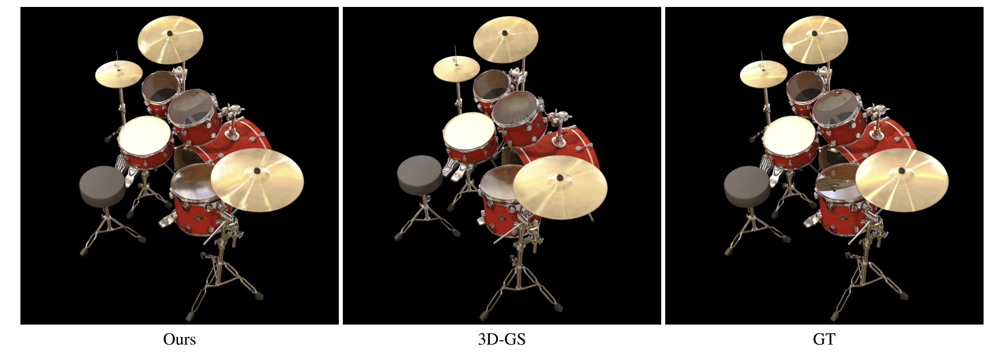
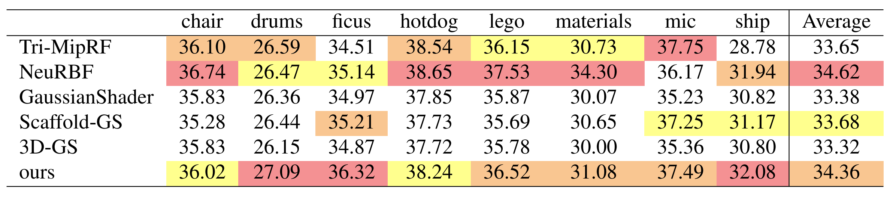
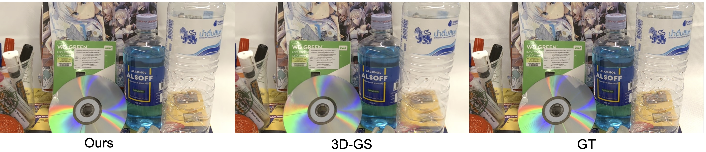

# Specular-Gaussians

It should be noted that this is **not an implementation of a paper**. The key modification I made was substituting SH with [ASG](https://cg.cs.tsinghua.edu.cn/people/~kun/asg/), enhancing the ability of 3D Gaussians to model complex specular. However, there's still room for improvement in the reflection quality. Despite this, **Specular-Gaussians** has emerged as the SOTA method based on 3D Gaussians for NeRF scenes. I've decided to release the code because I think simply adapting 3D-GS based on [nrff](https://github.com/imkanghan/nrff) and [NeuRBF](https://github.com/oppo-us-research/NeuRBF) doesn't seem sufficient to produce a truly useful paper.



## Run

### Environment

```shell
git clone https://github.com/ingra14m/Specular-Gaussians --recursive
cd Specular-Gaussians

conda create -n specular_gaussian_env python=3.7
conda activate specular_gaussian_env

# install pytorch
pip install torch==1.13.1+cu116 torchvision==0.14.1+cu116 torchaudio==0.13.1 --extra-index-url https://download.pytorch.org/whl/cu116

# install dependencies
pip install -r requirements.txt
```


### Train

```shell
python train.py -s path/to/your/nerf/dataset -m output/exp-name --eval
```


### Render & Evaluation

```shell
python render.py -m output/exp-name
python metrics.py -m output/exp-name
```


## Results

**Quantitative Results on NeRF Synthetic Dataset**

I conducted an evaluation on Specular Gaussians on the NeRF dataset, comparing it with the current SOTA methods. Unlike many methods based on 3D Gaussians, we bravely compared Tri-MipRF and NeuRBF, and achieved better rendering metrics in some scenes. The resolution in our experiment is 800x800, with a **black** background.



**Qualitative Results on Nex Dataset**

We demonstrated on the Nex dataset that our method can model anisotropic specular better than 3D-GS. Consistent with Nex, we downsampled x2 the dataset and measured the metrics.




## BibTex

Thanks to the authors of [3D Gaussians](https://repo-sam.inria.fr/fungraph/3d-gaussian-splatting/) for their excellent code, please consider cite this repository:

```
@Article{kerbl3Dgaussians,
      author       = {Kerbl, Bernhard and Kopanas, Georgios and Leimk{\"u}hler, Thomas and Drettakis, George},
      title        = {3D Gaussian Splatting for Real-Time Radiance Field Rendering},
      journal      = {ACM Transactions on Graphics},
      number       = {4},
      volume       = {42},
      month        = {July},
      year         = {2023},
      url          = {https://repo-sam.inria.fr/fungraph/3d-gaussian-splatting/}
}
```

If you find this implementation helpful, please consider to cite:

```
@misc{yang2023speculargs,
  title={Specular-Gaussians},
  author={Ziyi, Yang},
  publisher = {GitHub},
  journal = {GitHub repository},
  howpublished={\url{https://github.com/ingra14m/Specular-Gaussians}},
  year={2023}
}
```
