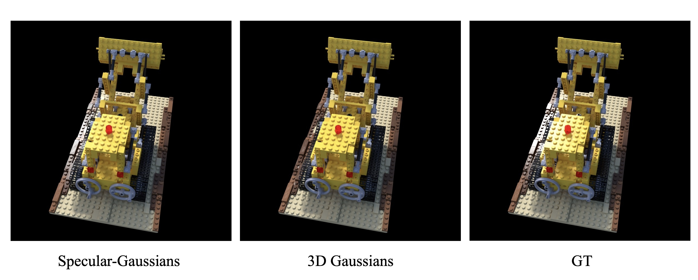
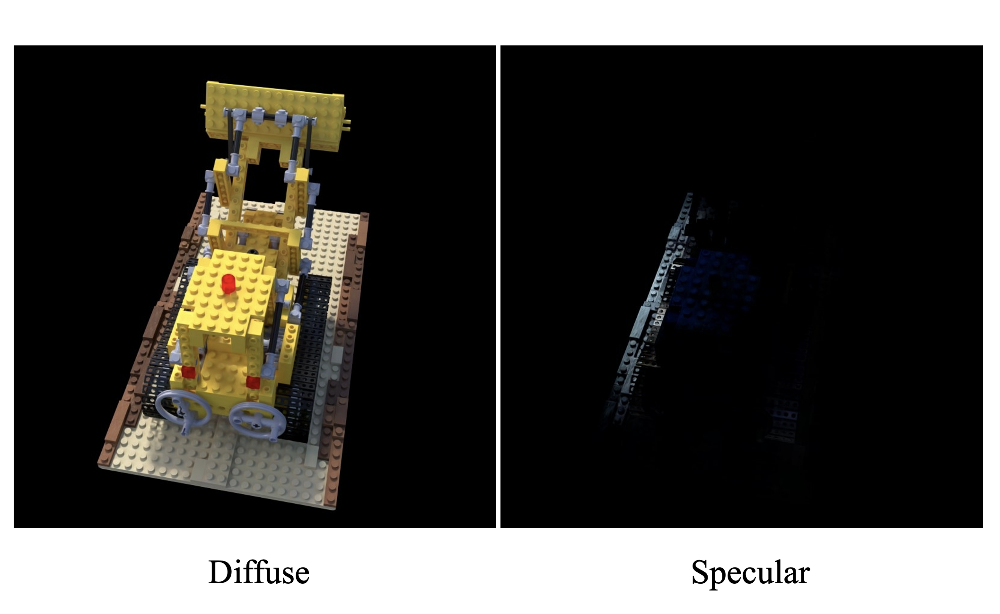

# Specular-Gaussians

This repository is merely an attempt to address the inability of 3D-GS to model specular accurately. I found that even in scenes like Lego, official 3D-GS struggles to model correct specular part. Therefore, I conducted some exploration into its modeling. 


I consider Spherical Harmonics (SH) as a form of low-frequency filter. Naturally, SH generates low-frequency signals, making it less suitable for modeling high-frequency specular. As a result, I segmented the signal using SH to model the low-frequency components and **employed Multi-Layer Perceptrons (MLP) for modeling the high-frequency components**. The results can be observed in the [Results](#Results).


## Run

### Environment

I have made some extensions to the official [diff-gaussian-rasterization](), remember to clone the modified rasterization pipeline from [my-repo](https://github.com/ingra14m/depth-diff-gaussian-rasterization)

```shell
git clone https://github.com/ingra14m/Specular-Gaussians --recursive
cd Specular-Gaussians

conda env create --file environment.yml
conda activate gaussian_env
pip install imageio==2.27.0
pip install opencv-python
pip install imageio-ffmpeg
```


## Results

**Rendering**



**Diffuse and Specular**




## BibTex

Thanks to the authors of [3D Gaussians](https://repo-sam.inria.fr/fungraph/3d-gaussian-splatting/) for their excellent code, please consider cite this repository:

```
@Article{kerbl3Dgaussians,
      author       = {Kerbl, Bernhard and Kopanas, Georgios and Leimk{\"u}hler, Thomas and Drettakis, George},
      title        = {3D Gaussian Splatting for Real-Time Radiance Field Rendering},
      journal      = {ACM Transactions on Graphics},
      number       = {4},
      volume       = {42},
      month        = {July},
      year         = {2023},
      url          = {https://repo-sam.inria.fr/fungraph/3d-gaussian-splatting/}
}
```

If you find this implementation helpful, please consider to cite:

```
@misc{yang2023speculargs,
  title={Specular-Gaussians},
  author={Ziyi, Yang},
  publisher = {GitHub},
  journal = {GitHub repository},
  howpublished={\url{https://github.com/ingra14m/Specular-Gaussians/}},
  year={2023}
}
```
