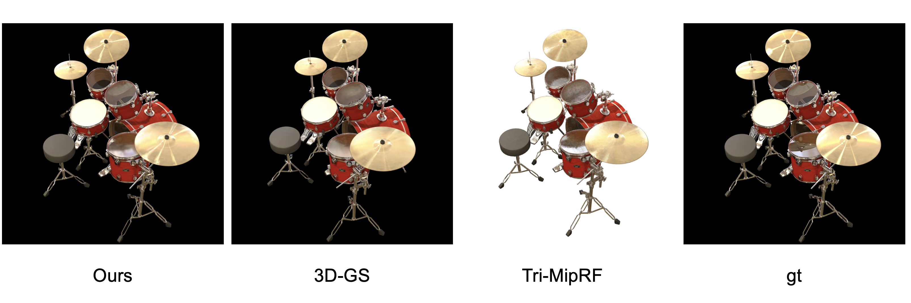

# My-exp-Gaussian

It should be noted that this is **not an implementation of a paper**. It was an early attempt to model specular highlights with 3D-GS. The official code together with the final paper will be released in another repo. Please stay tuned.



## Update

- 24/1/26 Hi, there! Thanks for the stars for all the people! Everyone's enthusiasm has made me realize that this is a meaningful work. It is with everyone's encouragement that I have completed a paper based on this repository (with a lot of improvements), which will help everyone understand why we can achieve high-quality specular highlight modeling with 3D-GS. Please stay tuned.
- I removed the normal. The normal would improve metrics, but its quality is so poor that it can't truly be called a normal. I have placed the model that includes the normal in the [normal](https://github.com/ingra14m/Specular-Gaussians/tree/normal) branch. After removing the normal, both training speed and rendering FPS will improve a lot.


## Run

### Environment

```shell
git clone https://github.com/ingra14m/My-exp-Gaussian --recursive
cd My-exp-Gaussian

conda create -n gaussian_env python=3.7
conda activate gaussian_env

# install pytorch
pip install torch==1.13.1+cu116 torchvision==0.14.1+cu116 torchaudio==0.13.1 --extra-index-url https://download.pytorch.org/whl/cu116

# install dependencies
pip install -r requirements.txt
```


### Train

```shell
python train.py -s path/to/your/nerf/dataset -m output/exp-name --eval
```


### Render & Evaluation

```shell
python render.py -m output/exp-name
python metrics.py -m output/exp-name
```

- To achieve higher metrics, you need to incorporate the following residual loss. However, this will reduce the quality of anisotropic specular rendering.

```python
if iteration > 3000:
  residual_color = render(viewpoint_cam, gaussians, pipe, background, mlp_color, hybrid=False)["render"]
  reflect_loss = l1_loss(gt_image - image, residual_color)
  loss = loss + reflect_loss
```


## Results

**Quantitative Results on NeRF Synthetic Dataset**

I conducted an evaluation on the NeRF dataset, comparing it with the current SOTA methods. Unlike many methods based on 3D Gaussians, we bravely compared Tri-MipRF and NeuRBF, and achieved better rendering metrics in some scenes. The resolution in our experiment is 800x800, with a **black** background.


**Qualitative Results on Nex Dataset**

We demonstrated on the Nex dataset that our method can model anisotropic specular better than 3D-GS. Consistent with Nex, we downsampled x2 the dataset and measured the metrics.


## Acknowledgment

I sincerely thank the authors of the following works, as their works have been referenced in my released codes: [nrff](https://github.com/imkanghan/nrff), [NeuRBF](https://github.com/oppo-us-research/NeuRBF), [Tri-MipRF](https://github.com/wbhu/Tri-MipRF), [GaussianShader](https://github.com/Asparagus15/GaussianShader), [Scaffold-GS](https://city-super.github.io/scaffold-gs/), [Nex](https://nex-mpi.github.io/), [3D-GS](https://repo-sam.inria.fr/fungraph/3d-gaussian-splatting/).


## BibTex

Thanks to the authors of [3D Gaussians](https://repo-sam.inria.fr/fungraph/3d-gaussian-splatting/) for their excellent code, please consider cite this repository:

```
@Article{kerbl3Dgaussians,
      author       = {Kerbl, Bernhard and Kopanas, Georgios and Leimk{\"u}hler, Thomas and Drettakis, George},
      title        = {3D Gaussian Splatting for Real-Time Radiance Field Rendering},
      journal      = {ACM Transactions on Graphics},
      number       = {4},
      volume       = {42},
      month        = {July},
      year         = {2023},
      url          = {https://repo-sam.inria.fr/fungraph/3d-gaussian-splatting/}
}
```
